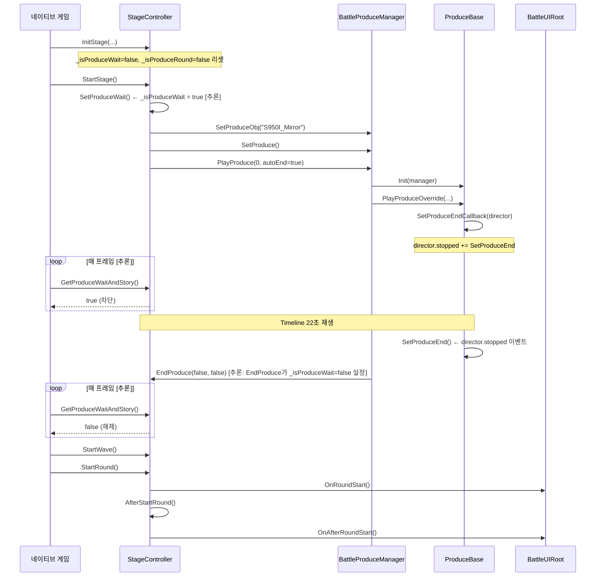

# Native Pre-Battle Produce Flow

> 작성일: 2026-08-04  
> 대상: LetheLauncher-Distribution-7 / Assembly-CSharp (IL2CPP interop)  
> 방법: ilspycmd 정적 분석 + LogOutput.log 런타임 분석 + Observer 패치 설계

---

## 1. 조사 목적

Limbus Company 9-50(`S950I_Mirror`) 전투가 전투 UI를 표시하지 않고 시네마틱을 재생한 뒤 정상적으로 1라운드를 시작하는 런타임 구조를 규명한다. 이를 바탕으로 커스텀 Apua(810001) 전투 시네마틱을 같은 경로로 연결하는 설계를 도출한다.

---

## 2. 기존 방식이 실패한 이유

### 2.1 StartRound Prefix 차단

```
StartStage Postfix: SetIsPause(true), Story1 Director.Play()
StartRound Prefix:  return false  ← 원본 차단
StartRound Postfix: 타 모드들의 Postfix 여전히 실행됨
AfterStartRound:    round=0에서 실행됨 (경로 불명)
```

**근본 원인**: Harmony에서 Prefix가 `false`를 반환해도 Postfix는 반드시 실행된다. 또한 `SetIsPause(true)`는 Time.timeScale을 조작할 뿐 전투 생명주기 코루틴/Update 루프를 멈추지 않는다.

**로그 근거** (LogOutput.log 기준):

| 행 | 내용 |
|----|------|
| 3427 | `Lifecycle attached; state=Playing` — Story1 시작, SetIsPause(true) |
| 3437 | `StartRound original deferred` — 우리 Prefix가 차단 |
| 3438 | `ModularSkillScripts Postfix_StartRound Round:0` — **타 모드 Postfix 실행됨** |
| 3441 | `LetheGiftLua StartRound fired round:0` — 또 다른 모드 실행 |
| 4083 | `AfterStartRound round=0` — StartRound body를 차단했는데 AfterStartRound 실행 |
| 4103 | `Story1 finished` — 9.384초 후 Story1 종료 |
| 4104 | `Story1 ended; invoking deferred StartRound` — 수동 재호출 |
| 4106 | `StartRound Round:1` — round=1 시작 |

**핵심 문제**: 라운드 0에서 전투 초기화 로직이 모두 실행되고, Story1 재생 중 배틀 UI가 나타남.

### 2.2 SetProduceWait 강제 유지

`SetProduceWait` Postfix에서 `_isProduceWait = true`를 유지했을 때, StartStage 자체가 차단되어 검은 화면 무한 대기가 발생했다. `SetProduceWait`가 전투 씬 진입 절차 중 여러 번 호출되며, Postfix로 true를 유지하면 절차 자체가 완료되지 못함.

**[런타임 확인 필요]**: SetProduceWait의 정확한 호출 순서와 호출 주체.

---

## 3. StageController 호출 순서

### 3.1 정적 분석으로 확인된 사항

```csharp
// StageController : Singleton<StageController>
// 모두 public unsafe void — 인터롭 노출됨

public void InitStage(IBattleStartData startData, PlayerUnitFormation formation, bool isCleared, bool isSandbox = false)
public void StartStage()           // Private_Void 원본, CallerCount(1) — 1곳에서 호출
public void StartWave()            // Private_Void 원본, CallerCount(1) — 1곳에서 호출
public void StartRound()           // Private_Void 원본, CallerCount(1) — 1곳에서 호출
public void AfterStartRound()      // Private_Void 원본, CallerCount(1) — 1곳에서 호출
public void SetProduceWait()       // CallerCount(2) — 2곳에서 호출
public bool GetProduceWaitAndStory()  // CallerCount(0) — 인터롭 미사용, 네이티브에서 직접 호출
public void SetProduceRound(bool value) // CallerCount(0)
public bool ShouldStartBattleImmediately()
public void SetIsPause(bool pause)  // CallerCount(0) — 외부(패치)에서만 호출됨
public int GetCurrentRound()
public ObscuredInt _currentRound   // 필드
public bool _isProduceWait         // 필드 (bool, 인터롭 직접 접근 가능)
public bool _isProduceRound        // 필드
```

**[확인됨]**: `StartStage`, `StartWave`, `StartRound`, `AfterStartRound`는 모두 **Private** 원본 메서드가 각각 정확히 1개의 네이티브 호출자를 가짐.

**[추론]**: CallerCount(1)이 각각 독립적이므로 체인이 아닌 별도 호출자에서 각각 호출될 가능성이 있음. 예: Update 루프가 조건에 따라 직접 호출.

### 3.2 로그에서 확인된 호출 순서 (810001 전투)

```
StartStage PRE/POST → [StartStage Postfix들 실행]
  → (동일 프레임 내?) StartRound PRE  ← 타 모드 Postfix와 우리 Prefix 모두 여기서 실행
  → AfterStartRound PRE  ← round=0에서 실행 (~9초 후)
```

**[런타임 확인 필요]**: 
- StartStage → StartWave → StartRound가 동기 체인인지, 별개 코루틴인지
- AfterStartRound가 누구에 의해 호출되는지 (StartRound body를 차단했는데 실행됨)
- `GetProduceWaitAndStory()`가 어떤 Update 루프에서 폴링되는지

### 3.3 9-50 원본 흐름 가설 (관찰 전)



**표시 범례**: `[추론]`, `[런타임 확인 필요]`, `[확인됨]`

---

## 4. StartRound 실제 호출자

### 4.1 정적 분석

`StartRound`는 `Private_Void_0` 원본 메서드로, CallerCount(1)이다. 즉, 정확히 1개의 네이티브 코드 위치에서 호출된다.

**[런타임 확인 필요]**: 
- Observer `StartRound_Pre` 로그에서 `Time.frameCount`를 보면 StartStage와 같은 프레임에 호출되는지 알 수 있음
- 만약 다른 프레임이면 Update 루프/코루틴 호출로 확정

### 4.2 핵심 관찰 포인트

Observer가 기록해야 할 핵심:

```
[BCO] GetProduceWaitAndStory => true   t=0.123 frame=5
[BCO] GetProduceWaitAndStory => false  t=22.456 frame=1345  ← 이 시점이 핵심
[BCO] StartWave PRE   t=22.456 frame=1346
[BCO] StartRound PRE  t=22.456 frame=1346
```

두 로그가 같은 프레임이면 Update 루프 패턴 확정.

---

## 5. ProduceWait 상태 전이

### 5.1 정적 분석

```csharp
// SetProduceWait(): 파라미터 없음, _isProduceWait = true로 설정 (CallerCount=2)
// GetProduceWaitAndStory(): bool 반환, 폴링에 사용 추정 (CallerCount=0 in interop)
// _isProduceWait: bool 필드, Harmony로 직접 읽기/쓰기 가능
```

### 5.2 가설 전이도

```
InitStage() 완료
   └─ _isProduceWait = false (리셋)
   
StartStage() 내부
   └─ SetProduceWait() 호출 → _isProduceWait = true  [추론]
   └─ Produce 설정 및 재생 시작
   
매 프레임 Update/코루틴 [추론]
   └─ GetProduceWaitAndStory() == true → StartWave/StartRound 차단
   
ProduceBase.SetProduceEnd() 또는 BPM.EndProduce()
   └─ _isProduceWait = false  [추론]
   
다음 프레임 Update/코루틴
   └─ GetProduceWaitAndStory() == false → StartWave() → StartRound() 실행
```

**[런타임 확인 필요]**: 
- `SetProduceEnd()` POST에서 `_isProduceWait`가 즉시 false가 되는지
- 아니면 `EndProduce()` 안에서 false가 되는지
- `GetProduceWaitAndStory()` false 전환과 `StartWave()` 호출 사이의 프레임 수

---

## 6. BattleProduceManager 상태 전이

### 6.1 확인된 메서드 시그니처

```csharp
public void SetProduceObj(string path, bool isSetAway = false, bool destroyPrevious = false)
public void SetProduce()
public void PlayProduce(int n = 0, bool autoEndCheck = true, DelegateEvent endCallBack = null, bool isMainCamera = false)
public void EndProduce(bool isAledyActive = false, bool isRoundStartBefore = false)
public bool isProducing          // 필드
public string _curObjPath        // 필드
public ProduceBase _curProduceBase  // 필드
```

### 6.2 관찰 목표

```
BPM.SetProduceObj POST curPath='S950I_Mirror'
BPM.SetProduce    POST isProducing=?
BPM.PlayProduce   PRE  autoEnd=true
BPM.PlayProduce   POST isProducing=?   ← producing=false 관찰됨 (로그 3449행)
BPM.EndProduce    PRE  alreadyActive=? roundStartBefore=?  ← 이 인자가 중요
BPM.EndProduce    POST isProducing=?
```

**이전 관찰 (로그 3449행 — BattleCinematicPlayer에서)**:
```
Story1 injected; wait=True, initialized=True, producing=False
```
PlayProduce 직후 `isProducing=false`인 이유 불명. `autoEndCheck=true`일 때 게임이 다른 경로로 종료를 처리하는지 확인 필요.

---

## 7. ProduceBase 종료 콜백 순서

### 7.1 확인된 메서드

```csharp
public virtual void Init(ProduceManager manager)
protected virtual void InitEndCallback()
protected void SetProduceEndCallback(PlayableDirector obj)  // director.stopped에 SetProduceEnd 등록 추정
public virtual void SetProduceEnd()   // 종료 트리거
public void SetEndCheck()             // 종료 조건 외부 주입
public virtual void PlayProduceOverride(int n, bool autoEnd = true, DelegateEvent endcallback = null)
public virtual void PlayProduce_Before()
```

### 7.2 관찰 목표 순서

Observer가 다음 순서를 확정해야 한다:

```
Director.Play → ProduceBase.PlayProduce_Before → ProduceBase.PlayProduceOverride
→ ProduceBase.SetProduceEndCallback  ← director.stopped에 SetProduceEnd 연결 여부
→ [Timeline 재생 중]
→ Director.Stop (또는 extrapolation으로 자연 종료)
→ ProduceBase.SetProduceEnd    ← director.stopped 이벤트 수신
→ BPM.EndProduce               ← SetProduceEnd 내부에서 호출? 또는 별개?
→ SC._isProduceWait = false    ← SetProduceEnd 또는 EndProduce에서?
→ [GetProduceWaitAndStory가 false 반환]
→ StartWave → StartRound
```

**[런타임 확인 필요]**: 위 순서 중 어느 단계에서 `_isProduceWait`가 false가 되는지.

---

## 8. 원본 카메라 전환

### 8.1 관련 타입

```csharp
// BattleCamManager : SingletonBehavior<BattleCamManager>
public Camera _mainCam
public Camera _curCam
public bool _isProduce       // ← Produce 상태 플래그 (필드)
public bool _isInitialized

// BattleCameraExchanger : MonoBehaviour  
public void SetActive(bool state)  // CallerCount(3)
public bool IsOn { get; }

// ProduceBase
public Camera _produceCam    // Produce 전용 카메라
public Camera _mainCam       // Produce 중 참조하는 메인 카메라
public Camera ProduceCam { get; }  // 프로퍼티
```

### 8.2 관찰 목표

Observer가 SetProduce POST 이후 로그해야 할 카메라 정보:

```
PRODUCE CAM go='...' active=? enabled=? depth=? ortho=? orthoSize=? clearFlags=?
```

**가설**: 
- Produce 카메라가 메인 카메라보다 depth가 높아 위에 렌더링됨 [추론]
- 메인 전투 카메라(`BattleCam_Main`)는 비활성화되지 않고 Produce 카메라에 가려짐 [추론]
- `BattleCamManager._isProduce = true`로 설정해 카메라 컨트롤을 분리함 [추론]

**[런타임 확인 필요]**: Produce 중 메인 카메라 state, BattleUI 카메라 state

---

## 9. 원본 HUD 표시·숨김 방식

### 9.1 BattleUIRoot 관찰 대상

```csharp
// BattleUI.BattleUIRoot
public Canvas battleUICanvas
public Canvas _perspectiveUICanvas
public bool IsRunningFadeEffect
public bool IsRunningWaveStart

// 핵심 메서드
[CallerCount(0)] public void OnStageStart_Before()  ← StartStage에서 호출 추정
[CallerCount(0)] public void OnStageStart()
[CallerCount(1)] public void OnRoundStart()          ← StartRound에서 호출, CallerCount=1
[CallerCount(0)] public void OnAfterRoundStart()
```

### 9.2 가설 

**[추론]**: `OnRoundStart()`는 `StartRound()`의 body 안에서 호출된다(CallerCount=1, StartRound CallerCount=1). 따라서 StartRound가 호출되지 않으면 배틀 UI가 초기화되지 않는다.

**관찰 목표**: 9-50 원본 흐름에서

| 시점 | OnStageStart_Before | OnStageStart | OnRoundStart |
|------|--------------------:|-------------:|-------------:|
| StartStage PRE | 미호출 | 미호출 | 미호출 |
| StartStage POST | ? | ? | 미호출 |
| Produce 재생 중 | ? | ? | 미호출 |
| EndProduce POST | ? | ? | 미호출 |
| StartRound PRE | ? | ? | 미호출 |
| StartRound POST | ? | ? | **호출됨** |

**[런타임 확인 필요]**: 위 표의 모든 ?를 채우는 것이 관찰 목표.

---

## 10. S950I_Mirror 프리팹 구조

### 10.1 이전 Observer 로그로 확인된 사실 (LogOutput.log 3434-3449)

```
produce path      : "S950I_Mirror"
root object       : "ProduceObject_S950I1_Mirror(Clone)"
script type       : ProduceBase (서브클래스 아님) [확인됨]
timeline asset    : "ProduceObject_S950I_Mirror_Timeline"
timeline duration : 22초
total tracks      : 8 (rootTracks=8, outputTracks=8)

index=0  Markers                            clips=0   <unbound>
index=1  Animation Track                    clips=8   ProduceObject_S950I1_Mirror(Clone)
index=2  Animation Track (1)               clips=8   ProduceObject_S950I1_Mirror(Clone)
index=3  Character Appearance TL_Produce    clips=0   ProduceObject_S950I1_Mirror(Clone)
index=4  Character Appearance TL_Produce(1) clips=0   ProduceObject_S950I1_Mirror(Clone)
index=5  FMOD Custom Track                  clips=13  <unbound>
index=6  FMOD Custom Track_Loop             clips=0   <unbound>
index=7  Effect Activate Timeline Track     clips=1   <unbound>

component count   : 91
component types   : [Component, PlayableDirector, ProduceBase]
```

### 10.2 새 Observer가 추가로 확인할 사항

새 `LogProducePrefab()`은 다음을 추가로 기록:
- `PRODUCE TIMELINE timeMode=` — UpdateMode 확인
- `PRODUCE CAM` — Produce 카메라 상세 정보

**[런타임 확인 필요]**: S950I_Mirror Director의 `timeUpdateMode` (GameTime? UnscaledGameTime?)

---

## 11. PlayableDirector 상태 전이

### 11.1 새 Observer 패치

```csharp
Director.Play PRE  go='...' asset='ProduceObject_S950I_Mirror_Timeline' timeMode=? dur=22.0
Director.Stop PRE  go='...' asset='...' state=? time=? dur=22.0
```

### 11.2 관찰 목표

```
[BCO] Director.Play PRE  go='ProduceObject_S950I1_Mirror(Clone)' asset='...' timeMode=GameTime dur=22.000
[22초 후]
[BCO] Director.Stop PRE  go='...' state=Stopped time=22.000 dur=22.000  ← 자연 종료
[BCO] ProduceBase.SetProduceEnd PRE  ...   ← stopped 이벤트로 즉시 후속
```

또는 `extrapolationMode = None`이면 director가 알아서 멈추고 stopped 이벤트가 발생.

---

## 12. Harmony 패치 충돌 분석

### 12.1 확인된 타 모드 StartRound Postfix 목록

| 모드 | 패치 | 실행 시점 |
|------|------|----------|
| ModularSkillScripts | `Postfix_StageController_StartRound` | StartRound body 전후 무관하게 실행 |
| LetheGiftLua | `StageController.StartRound fired` | 동일 |
| BattleMessage | `AfterStartRound round=?` 로깅 | AfterStartRound Postfix |

**[확인됨]**: `StartRound Prefix return false`로 원본 차단 시에도 이 Postfix들은 반드시 실행됨.

### 12.2 Prefix 차단의 근본 문제

```
StartRound Prefix (our) → return false
  ↓ (body skipped)
StartRound Postfix (ModularSkillScripts) → 실행됨
StartRound Postfix (LetheGiftLua) → 실행됨
```

이것은 Harmony의 설계 원칙이며 우회 불가. 따라서 **StartRound 자체가 호출되지 않도록** 해야 한다.

### 12.3 올바른 접근: ProduceWait 게이트 사용

게임 원본 9-50 시네마틱이 StartRound를 막는 방법:
- `SetProduceWait()`으로 `_isProduceWait = true` 설정
- StartRound를 호출하는 루프가 `GetProduceWaitAndStory() == true`이면 호출 자체를 건너뜀
- 따라서 StartRound Prefix/Postfix 자체가 실행되지 않음

이것이 달성되면:
- 타 모드의 StartRound Postfix도 실행되지 않음
- AfterStartRound도 실행되지 않음
- BattleUIRoot.OnRoundStart도 실행되지 않음
- 배틀 UI가 나타나지 않음

---

## 13. 확인된 사실

| 사실 | 근거 |
|------|------|
| `StartRound` Private 원본, CallerCount(1) — 1개의 네이티브 호출자 | ilspycmd Assembly-CSharp.dll |
| `StartWave` Private 원본, CallerCount(1) | 동일 |
| `AfterStartRound` Private 원본, CallerCount(1) | 동일 |
| `SetProduceWait()` CallerCount(2) — 2곳에서 호출 | 동일 |
| `GetProduceWaitAndStory()` CallerCount(0) in interop — 네이티브 직접 호출 | 동일 |
| `SetIsPause(bool)` CallerCount(0) in interop — 외부에서만 호출 | 동일 |
| `BattleCamManager._isProduce` bool 필드 존재 | ilspycmd |
| `BattleUIRoot.OnRoundStart()` CallerCount(1) — StartRound에서 호출 | ilspycmd |
| `BattleUIRoot.OnStageStart_Before()` CallerCount(0) in interop | ilspycmd |
| `ProduceBase.SetProduceEndCallback(PlayableDirector)` — stopped 이벤트 등록 표준 경로 | ilspycmd |
| `ProduceBase.SetEndCheck()` — 외부 종료 주입 가능 | ilspycmd |
| `BattleCameraExchanger.SetActive(bool)` CallerCount(3) | ilspycmd |
| S950I_Mirror scriptType = ProduceBase (서브클래스 아님) | LogOutput.log 행 3434 |
| StartRound Prefix return false로 차단해도 타 모드 Postfix 실행됨 | LogOutput.log 행 3437-3441 |
| Story1 SetIsPause(true) 중에도 AfterStartRound가 round=0에서 실행됨 | LogOutput.log 행 4083 |

---

## 14. 아직 확인되지 않은 내용

| 항목 | 확인 방법 |
|------|----------|
| StartStage → StartWave → StartRound가 동기 체인인지, Update 루프인지 | Observer `frame=` 비교 |
| `GetProduceWaitAndStory()` 호출 주체와 폴링 주기 | Observer 중복 제거 로그 |
| `SetProduceWait()` 2개 호출자의 정체 | Observer `SetProduceWait PRE` 스택 컨텍스트 |
| `AfterStartRound round=0`이 왜 실행됐는지 (body 차단 시) | Observer `AfterStartRound PRE frame=` 비교 |
| ProduceBase.SetProduceEnd → _isProduceWait=false 연결 경로 | Observer `SetProduceEnd POST wait=` |
| S950I_Mirror Director의 timeUpdateMode | Observer `Director.Play PRE timeMode=` |
| EndProduce의 isRoundStartBefore 인자 값 | Observer `BPM.EndProduce PRE` |
| Produce 카메라 depth, clearFlags 등 | Observer `PRODUCE CAM` |
| 배틀 UI(BattleUIRoot) 초기화 시점 | Observer `BattleUIRoot.OnStageStart` 등 |

---

## 15. 독립 커스텀 시네마틱 권장 설계

### 15.1 가설 기반 권장 설계

**핵심 원칙**: 게임의 ProduceWait 게이트를 올바르게 사용하면 StartRound가 호출되지 않아 타 모드 Postfix 문제와 배틀 UI 문제가 모두 자동 해결된다.

```
[StartStage Postfix — 우리 코드]
1. stage.SetProduceWait()          ← _isProduceWait = true
2. Story1 프리팹 Instantiate
3. Director.Play()                 ← UnscaledGameTime 모드

[게임 Update 루프 (자동)]
4. GetProduceWaitAndStory() == true → StartRound 차단

[Story1 종료 (CinematicLifecycle.Update)]
5. produce.SetEndCheck()           ← 종료 조건 주입
   OR
   stage._isProduceWait = false    ← 직접 필드 쓰기

[게임 Update 루프 (자동)]
6. GetProduceWaitAndStory() == false → StartWave() → StartRound() 정상 실행
7. BattleUIRoot.OnRoundStart() 정상 호출
```

**이 설계의 장점**:
- StartRound Prefix 불필요 → 타 모드 Postfix 오염 없음
- SetIsPause 불필요 → Time.timeScale 간섭 없음
- StartRound 수동 재호출 불필요 → 생명주기 중복 없음
- 배틀 UI가 Story1 중 나타나지 않음 (OnRoundStart가 자연스럽게 나중에 호출)

### 15.2 미확인 위험

- `SetProduceWait()`가 StartStage 내부에서 이미 호출되는 경우, Postfix에서 다시 호출해도 안전한지 [런타임 확인 필요]
- 5단계에서 `produce.SetEndCheck()` vs `stage._isProduceWait = false` 중 어느 것이 안전한지 [런타임 확인 필요]
- StartStage Postfix와 GetProduceWaitAndStory 폴링 사이에 경쟁 조건이 없는지 [런타임 확인 필요]

### 15.3 안전장치

- 타임아웃 Coroutine: `Story1.duration + 0.5s` 후 강제 `_isProduceWait = false` — 영구 정지 방지
- catch 블록에서 무조건 `stage._isProduceWait = false`

---

## 16. 구현 금지 방식

| 방식 | 금지 이유 |
|------|----------|
| `StartRound Prefix return false` | Harmony Postfix가 실행되며 타 모드가 라운드 처리를 시작함 |
| `StartStage Prefix return false` | StartStage Postfix가 실행됨, 다른 모드의 Postfix들이 모두 실행됨 |
| `SetProduceWait Postfix에서 강제 true 유지` | StartStage 자체가 완료되지 않아 검은 화면 무한 대기 |
| `SetIsPause(true)` 단독 사용 | 전투 생명주기 코루틴을 멈추지 않음 |
| `StartRound() 수동 재호출` | round 카운터 중복, 다른 Postfix가 round=0에서 이미 실행됨 |
| `StorySystem 사용` | 스토리 시스템은 별도의 씬 전환을 트리거하며 전투 씬 구조와 충돌 |

---

## 17. 다음 구현 체크리스트

관찰 후 다음 항목이 확인되면 구현 가능:

- [ ] **관찰 1**: Observer로 9-50 전투 진행, `GetProduceWaitAndStory` 로그에서 폴링 패턴 확인
- [ ] **관찰 2**: `SetProduceEnd POST wait=false` 로그 확인 — ProduceWait 해제 경로 확정
- [ ] **관찰 3**: `BattleUIRoot.OnStageStart` vs `OnRoundStart` 호출 시점 비교
- [ ] **관찰 4**: `EndProduce PRE alreadyActive=? roundStartBefore=?` 인자 확인
- [ ] **관찰 5**: `StartWave PRE frame=` vs `GetProduceWaitAndStory => false frame=` — 동일 프레임 여부
- [ ] **설계 확정**: ProduceWait 해제 방식 (SetEndCheck vs 직접 필드 쓰기) 결정
- [ ] **BattleCinematicPlayer 수정**: StartRound Prefix/defer 코드 제거, SetProduceWait 호출 추가, 종료 시 적절한 해제 메서드 호출

---

## 18. 근거 로그

| 결론 | 근거 파일/위치 |
|------|---------------|
| StartRound 차단 시 Postfix 실행됨 | `LogOutput.log` 행 3437-3441 |
| AfterStartRound round=0 실행 (원인 불명) | `LogOutput.log` 행 4083 |
| producing=False 관찰 (PlayProduce 직후) | `LogOutput.log` 행 3449 (이전 Observer) |
| StageController 메서드 시그니처 전체 | `Assembly-CSharp.dll` ilspycmd |
| ProduceBase 필드/메서드 전체 | `Assembly-CSharp.dll` ilspycmd |
| BattleUIRoot.OnRoundStart CallerCount(1) | `Assembly-CSharp.dll` ilspycmd |
| BattleCamManager._isProduce 필드 | `Assembly-CSharp.dll` ilspycmd |
| S950I_Mirror 런타임 구조 | `LogOutput.log` 행 3434-3449 (이전 Observer) |
| 현재 BattleCinematicPlayer 구현 | `BattleCinematicPlayer/CinematicPatches.cs`, `CinematicLifecycle.cs` |

---

## Observer DLL 배포 안내

**게임을 종료한 후 다음 명령을 실행하라:**

```powershell
Copy-Item "C:\Users\이동혁\Desktop\BattleCinematicObserver\Release\BattleCinematicObserver.dll" `
  "C:\Users\이동혁\Desktop\LIMBUS\LetheLauncher-Distribution-7\BepInEx\plugins\BattleCinematicObserver.dll" -Force
```

**인게임 절차:**

1. 게임 실행 후 **9-50 스테이지(S950I_Mirror)** 진입 — BattleCinematicPlayer가 개입하지 않는 원본 Produce 흐름 관찰
2. 전투가 완전히 시작되어 1라운드 Command Phase에 진입할 때까지 진행
3. 게임 종료 후 `LogOutput.log`에서 `[BCO]` 태그로 필터링하여 확인

**주요 확인 패턴:**

```
[BCO] SetProduceWait PRE  ...
[BCO] GetProduceWaitAndStory => true  ... frame=N
[BCO] GetProduceWaitAndStory => false ... frame=M
[BCO] StartWave PRE  ... frame=?
[BCO] ProduceBase.SetProduceEnd PRE  ...
[BCO] BPM.EndProduce PRE  alreadyActive=? roundStartBefore=?
[BCO] BattleUIRoot.OnRoundStart ...
```
