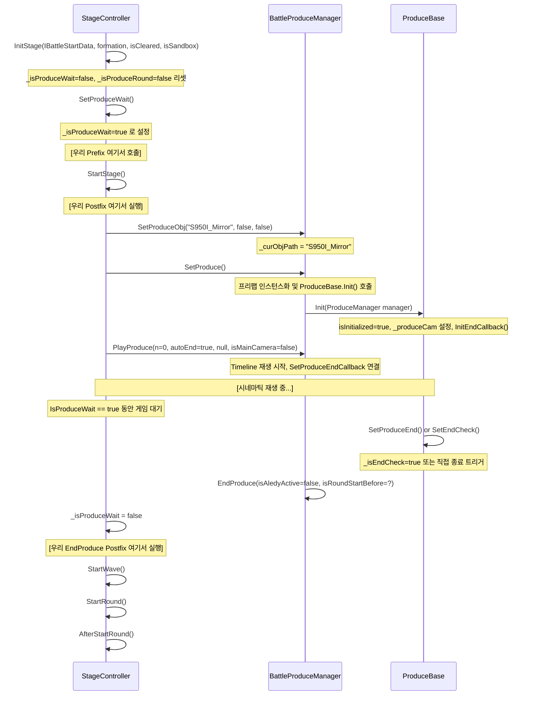

# Custom Battle Cinematic Research

> 작성일: 2026-08-04  
> 대상 빌드: BattleCinematicPlayer 0.1.0 / BattleCinematicObserver 1.0.0  
> 인터롭 DLL: Assembly-CSharp (LetheLauncher-Distribution-7)

---

## 1. 목표와 제약

**목표**: Limbus Company 전투 시작 전(라운드 1 직전) 커스텀 시네마틱(Aqua/Story1Cinematic 프리팹)을 게임의 ProduceWait 게이트를 통해 재생하고, 시네마틱 종료 후 전투가 정상적으로 시작되도록 한다.

**대상 전투**: 미러던전 Apua 인카운터 810001 (StageModel.ClassInfo.id == 810001)

**제약**:
- DLL 수정/빌드/배포 금지 (이 문서는 읽기·분석 전용)
- 기존 모션 시스템(motions.dll)과 독립적으로 동작
- 실패 시 반드시 `_isProduceWait = false` 로 리셋하여 전투가 막히지 않도록 안전 해제

---

## 2. 현재 실패 기록

| 증상 | 상태 |
|------|------|
| `BattleProduceManager` not found after StartStage | 로그에서 미발생 - 정상 |
| Story1 prefab 로드 실패 | 로그에서 미발생 - 정상 |
| `produce.IsInitialized == false` 로 NRE | 로그에서 미발생, `initialized=True` 확인 |
| `producing=False` (PlayProduce 이후에도) | 로그 3449행 관찰됨 — **[런타임 확인 필요]** |
| EndProduce 로그 미발생 | 관찰됨 — produce 종료 경로 불확실 **[런타임 확인 필요]** |
| 전투 stuck (ProduceWait 해제 안 됨) | **[런타임 확인 필요]** |

**핵심 관찰 (로그 3449행)**:
```
[BattleCinematicPlayer] Story1 injected into native 'S950I_Mirror' produce;
duration=9.333, wait=True, initialized=True, producing=False
```
`PlayProduce` 호출 직후에도 `manager.isProducing == false`이다. 이는 `PlayProduce` 내부에서 `isProducing`이 즉시 true로 설정되지 않을 가능성, 또는 `SetProduce() + PlayProduce()` 내부의 비동기 처리 가능성을 시사한다. **[런타임 확인 필요]**

---

## 3. 전투 시작 생명주기

### 3.1 호출 순서



### 3.2 각 메서드 시그니처

```csharp
// StageController : Singleton<StageController>
public void InitStage(IBattleStartData startData, PlayerUnitFormation formation, bool isCleared, bool isSandbox = false)
public void StartStage()           // private void — IL2CPP interop wrapper
public void StartWave()            // private void
public void StartRound()           // private void
public void AfterStartRound()      // private void

public void SetProduceWait()       // no parameter — _isProduceWait = true
public bool GetProduceWaitAndStory() // ProduceWait 상태이면 true 반환, 라운드 시작 블로킹
public bool ShouldStartBattleImmediately() // 즉시 전투 시작 여부
public bool IsProduceWait { get; }  // _isProduceWait 읽기 전용 프로퍼티
public bool IsProduceRound { get; } // _isProduceRound 읽기 전용 프로퍼티

// 직접 접근 가능한 backing field
public bool _isProduceWait;        // Harmony로 직접 읽기/쓰기 가능 [확인됨]
public bool _isProduceRound;
```

### 3.3 ProduceWait 상태 전이도

```
InitStage 호출
    └─> _isProduceWait = false (리셋)

SetProduceWait() 호출
    └─> _isProduceWait = true
           │
           └─ GetProduceWaitAndStory() == true
                  │
                  └─ 라운드 시작 블로킹 중
                         │
                  SetProduceEnd() / SetEndCheck() 호출
                         │
                         └─> _isProduceWait = false (또는 EndProduce 내부에서)
                                    │
                                    └─ StartWave() → StartRound() → AfterStartRound()
```

**[확인됨]**: `_isProduceWait`은 `bool` 타입의 인스턴스 필드  
**[런타임 확인 필요]**: `SetProduceEnd`가 `_isProduceWait`를 직접 false로 만드는지, 아니면 `EndProduce` → `StageController` 콜백 체인을 거치는지

---

## 4. BattleProduceManager 구조

### 4.1 클래스 계층도

```
MonoBehaviour
  └─ ProduceManager (base class, 미확인)
        └─ BattleProduceManager
```

### 4.2 주요 필드

```csharp
// BattleProduceManager 인스턴스 필드
public ProduceBase _curProduceBase;                  // 현재 활성 ProduceBase
public Dictionary<string, GameObject> _produceObjs;  // 로드된 produce 오브젝트 캐시
public string _curObjPath;                           // 현재 path ("S950I_Mirror")
public bool isProducing;                             // 재생 중 여부 [추론: PlayProduce 이후 true]
public bool isMainCam;                               // 메인 카메라 사용 여부
```

### 4.3 주요 메서드 시그니처

```csharp
// BattleProduceManager : ProduceManager
public override void Init()
public override void SetProduceObj(string path, bool isSetAway = false, bool destroyPrevious = false)
public override void SetProduce()
public override void PlayProduce(int n = 0, bool autoEndCheck = true, DelegateEvent endCallBack = null, bool isMainCamera = false)
public override void EndProduce(bool isAledyActive = false, bool isRoundStartBefore = false)
public override void EndProduceAledyActive(bool isRoundStartBefore)
public override bool isSetRatio()
public override bool GetIsProducing()
public override Camera GetProduceCamera()
public override ProduceBase GetProduceScript()      // [확인됨] CallerCount=9
public override int GetCurrentTimelineIndex()
public override void SetCurrentProduceTime(float value)
public override float GetCurrentProduceTime()
```

### 4.4 SetProduceObj path 인자 형식

로그에서 확인: `path = "S950I_Mirror"` (슬래시 없는 단순 문자열)  
[확인됨] Resources 폴더 경로 또는 내부 캐시 키로 사용됨  
[런타임 확인 필요] `_produceObjs` 캐시에 이 키로 저장된 프리팹의 실제 경로

---

## 5. ProduceBase 필수 초기화 조건

### 5.1 모든 필수 필드 목록 (타입 포함)

```csharp
// ProduceBase : MonoBehaviour
// 필드 (모두 public — Harmony로 직접 접근 가능)
ProduceManager     _produceManager;        // Init() 파라미터로 설정
Camera             _produceCam;            // Awake() 또는 Init()에서 설정 [추론]
List<GameObject>   _lookCamObjects;        // 카메라 추적 오브젝트 목록
PlayableDirector   _director;             // 주 Timeline Director [우리가 교체]
TimelineAsset      _timeline;             // 재생할 Timeline [우리가 교체]
List<float>        _startPointSecond;     // 각 timeline 구간의 시작 시각(초) [우리가 [0f] 로 초기화]
object             _effectScaler;         // 이펙트 스케일러 [추론: 별도 컴포넌트]
bool               isInitialized;         // Init() 완료 플래그 [확인됨: true]
object             _camManager;           // BattleCamManager 인스턴스 [추론]
Camera             _mainCam;              // 전투 메인 카메라 [추론]
bool               _isProducing;          // ProduceBase 내부 재생 플래그
DelegateEvent      _endCallBack;          // 종료 콜백 (PlayProduce 인자)
bool               _isEndCheck;           // 종료 조건 체크 활성화 여부
bool               _isIngameTest;         // 인게임 테스트 모드
int                _curTimelineIndex;     // 현재 timeline 구간 인덱스 [우리가 0으로 설정]
float              shakeDistance;         // 카메라 흔들기 거리
bool               _isAutoEnd;           // 자동 종료 활성화 여부
bool               _isSetRatio;          // 비율 설정 여부
bool               isRotateZ;            // Z축 회전 여부
SCENE_STATE        _curSceneState;        // 씬 상태 (NONE, STORY, BATTLE, TEST)
List<ProduceAddOn> _produceAddOn;         // 추가 기능 컴포넌트 목록
Tween              shakeTween;            // 흔들기 트윈
float              _curTimeScale;         // 현재 타임스케일
Tween              _speedTween;           // 속도 트윈
```

### 5.2 주요 메서드

```csharp
public virtual void Init(ProduceManager manager)       // 초기화 진입점
public virtual void InitEndCallback()                  // 종료 콜백 초기화
public void SetRatio(bool)
protected void SetProduceEndCallback(PlayableDirector) // director.stopped 에 SetProduceEnd 등록
public virtual void SetProduceEnd()                    // 종료 트리거 (콜백으로 호출)
public void SetEndCheck()                              // 종료 대기 해제 — 게임이 ProduceWait 풀기 위해 폴링
public PlayableDirector GetDirector()                  // _director 반환
public virtual void OnNotify(Playable, INotification, Object) // Signal 수신
public void SetIsProdusing(bool)
public bool GetIsProdusing()
public virtual void OnCamShake(float)
public virtual void OnShakeCamera_Detail(CharacterAppearanceMarker_CameraShaker, Vector3)
public void InitViews(List<BattleUnitView>, bool)
```

### 5.3 Init() NRE 원인 가설

| 가설 | 근거 | 신뢰도 |
|------|------|--------|
| `_produceCam`이 null — 프리팹에 카메라 컴포넌트 없음 | ProduceBase.Init()이 Inspector serialized 필드에 의존 가능 | [추론] |
| `_camManager` null — BattleCamManager 미초기화 | Singleton이므로 전투 씬 진입 후 정상 | [낮음] |
| `SetProduceObj` 후 `_curProduceBase.Init()` 재호출 — `SetProduce()` 내부에서 Init 재실행 | SetProduce Postfix 로그에서 `PRODUCE PREFAB root='ProduceObject_S950I1_Mirror(Clone)'` 확인, initialized=True | [확인됨: NRE 없음] |

**현재 NRE 발생 없음**: 로그 3449행에서 `initialized=True` 확인됨.

---

## 6. S950I_Mirror 분석

### 6.1 로그/Observer에서 확인된 런타임 구조

[확인됨] 로그 3434-3449행:

```
produce path      : "S950I_Mirror"
root object       : "ProduceObject_S950I1_Mirror(Clone)"
script type       : ProduceBase (서브클래스 아님)
timeline asset    : "ProduceObject_S950I_Mirror_Timeline"
timeline duration : 22초
total tracks      : 8 (rootTracks=8, outputTracks=8)

index=0  Markers                            TrackAsset  clips=0   <unbound>
index=1  Animation Track                    TrackAsset  clips=8   ProduceObject_S950I1_Mirror(Clone) [Object]
index=2  Animation Track (1)               TrackAsset  clips=8   ProduceObject_S950I1_Mirror(Clone) [Object]
index=3  Character Appearance TL_Produce    TrackAsset  clips=0   ProduceObject_S950I1_Mirror(Clone) [ProduceBase]
index=4  Character Appearance TL_Produce(1) TrackAsset  clips=0   ProduceObject_S950I1_Mirror(Clone) [ProduceBase]
index=5  FMOD Custom Track                  TrackAsset  clips=13  <unbound>
index=6  FMOD Custom Track_Loop             TrackAsset  clips=0   <unbound>
index=7  Effect Activate Timeline Track     TrackAsset  clips=1   <unbound>

component count   : 91
component types   : [Component, PlayableDirector, ProduceBase]
```

### 6.2 확인된 사실 vs 런타임 확인 필요 항목

| 항목 | 상태 |
|------|------|
| script type이 `ProduceBase` 직접 (서브클래스 없음) | [확인됨] |
| `isInitialized = true` 주입 시점에 이미 완료 | [확인됨] |
| `wait=True` (ProduceWait 활성) 주입 후에도 유지 | [확인됨] |
| `producing=False` PlayProduce 직후 | [확인됨 - 원인 불명] |
| `EndProduce` 호출 여부 | [런타임 확인 필요] |
| `SetProduceEnd` → `_isProduceWait=false` 연결 경로 | [런타임 확인 필요] |
| 주입된 Story1 director의 `stopped` 이벤트가 `SetProduceEnd` 트리거하는지 | [런타임 확인 필요] |

---

## 7. 카메라 및 화면효과 구조

### 7.1 카메라 타입 목록

| 타입 | 역할 |
|------|------|
| `BattleCamManager : SingletonBehavior<BattleCamManager>` | 전투 카메라 총괄. 직교 줌, 흔들기, 피봇 제어 |
| `BattleCam_Main` | 메인 전투 카메라 |
| `BattleCam_UI` | UI 전용 카메라 |
| `BattleSkillCam` | 스킬 연출 전용 카메라 |
| `BattleSkillCam_RenderTexture` | RenderTexture 기반 스킬 카메라 |
| `BattleCameraExchanger` | 카메라 전환 관리 |
| `ProduceBase._produceCam` | Produce 전용 카메라 (Camera 타입) |
| `ProduceBase._mainCam` | Produce 중 참조하는 메인 카메라 |

### 7.2 BattleCamManager 핵심 필드

```csharp
// BattleCamManager : SingletonBehavior<BattleCamManager>
Camera  _mainCam;                // 메인 카메라 참조
float   _zoomSize;               // 현재 줌 크기
float   _camDefaultOrthoSize;    // 기본 직교 카메라 크기
float   _camzoomOrthoSize;       // 줌된 직교 카메라 크기
float   _camRotationXValue;      // X축 회전값
float   _zoomSpeed;              // 줌 속도
Vector3 _zoomPosYZ_Start;        // 줌 시작 YZ 위치
Vector3 _zoomPosYZ_End;          // 줌 종료 YZ 위치
// 피봇 관련
GameObject _camPivot_Offset;
GameObject _camPivot_FocusNew;
GameObject _camPivot_RotateY;
GameObject _camPivot_RotateOffset;
GameObject _camPivot_RotateX;
GameObject _camPivot_Shake;
```

**[확인됨]** BattleCamManager는 직교 투영(`orthographicSize`) 방식으로 줌을 구현한다.

### 7.3 cinematic.json → API 연결 방식

```json
{
  "sequences": {
    "Story1": {
      "totalDuration": 9.333,
      "zooms": [
        { "start": 0.0, "duration": 2.5, "size": -4.0, "attacker": true }
      ],
      "shakes": [
        { "start": 0.85, "duration": 0.4, "strength": 0.6 }
      ]
    }
  }
}
```

**[추론]** 현재 `CinematicPatches.cs`는 이 JSON을 읽지 않는다. JSON은 구현 예정 사항으로 정의된 설계 스펙이다. 실제 줌/흔들기를 적용하려면:
- `BattleCamManager.Singleton` → `_camzoomOrthoSize` 조작 또는 Tween 메서드 호출
- `ProduceBase.OnCamShake(strength)` 또는 `OnShakeCamera_Detail_Rotation(...)` 호출
- 또는 Coroutine으로 타이밍에 맞춰 직접 호출

---

## 8. Aqua AssetBundle 분석

### 8.1 현재 Story1Cinematic 프리팹 구조

```
Story1Cinematic (root, Transform only)
├── Story1              (Transform + PlayableDirector → Story1.playable)
│   PlayableDirector bindings:
│   - Appearance.Animator
│   - sword_vfx.Animator
│   - shadow_0.Animator
│   - shadow_1.Animator
│   - sword_vfx 1.Animator
│   - sword_vfx 2.Animator
├── Appearance          (Transform + SpriteRenderer + Animator)
│   SortingOrder=5, size=(2.125, 1.979), alpha=1.0
├── sword_vfx           (Transform + SpriteRenderer + Animator)
│   실제 스프라이트(guid: ba1cdcda...) 할당됨, alpha=0
├── shadow_0            (Transform + SpriteRenderer + Animator)
│   SortingOrder=1, alpha=0.3
├── shadow_1            (Transform + SpriteRenderer + Animator)
│   SortingOrder=2, alpha=1.0
├── sword_vfx 1         (Transform + SpriteRenderer + Animator)
│   SortingOrder=0, 분홍(255,0,1) alpha=0.1
└── sword_vfx 2         (Transform + SpriteRenderer + Animator)
    SortingOrder=0, white alpha=1.0
```

**Story1.playable** (Timeline):
- 총 길이: 9.333초
- Animator 트랙 6개: Appearance, sword_vfx, shadow_0, shadow_1, sword_vfx 1, sword_vfx 2
- "Recorded" 클립: Appearance의 위치·스케일·색상 애니메이션
- "Recorded (4)" 클립: 스프라이트 flash 애니메이션 (0~4.58s)
- 9.333s 에서 끝나는 위치 키프레임 확인됨 (x=3, y=2.3)

### 8.2 추가 필요 컴포넌트

[추론] 현재 프리팹에는 카메라 제어, 오디오 트랙이 없다. 필요하다면:
- 카메라 줌/흔들기: coroutine 방식 또는 Timeline Signal으로 별도 구현
- 오디오: FMOD 이벤트를 직접 호출하는 스크립트 추가 필요

---

## 9. 가능한 구현 방식 비교

| 방식 | 설명 | 장점 | 단점 | 안전성 |
|------|------|------|------|--------|
| **A. 현재 방식** (native produce에 director 교체) | SetProduceObj로 S950I_Mirror를 로드하고, ProduceBase._director와 _timeline을 교체 | 게임의 ProduceWait 해제 체계를 그대로 활용 | director 교체 후 stopped 이벤트가 SetProduceEnd에 연결 안 될 수 있음 | 중간 |
| **B. 완전 독립 Director** | 별도 GameObject에서 PlayableDirector.Play()만 실행, ProduceWait은 직접 false | 구현 단순 | ProduceWait 게이트와 완전히 분리 — 게임 상태 불일치 위험 | 낮음 |
| **C. SetProduceEndCallback 재등록** | native Director 비활성화 후 custom director.stopped에 produce.SetProduceEnd 등록 | EndProduce 경로 보장 | Il2CppSystem.Action 바인딩 복잡 | 높음 |
| **D. autoEndCheck Polling** | PlayProduce(autoEndCheck=true) 유지, 게임이 _director.state==Stopped 폴링 | 코드 변경 최소화 | 폴링 경로가 실제로 존재하는지 [런타임 확인 필요] | 중간 |
| **E. ProduceBase.SetEndCheck 직접 호출** | director.stopped 이벤트에서 produce.SetEndCheck() 직접 호출 | 명확한 종료 경로 | SetEndCheck 내부 로직이 ProduceWait 해제까지 도달하는지 확인 필요 | 중간 |

---

## 10. 권장 아키텍처

### 1순위: 방식 C + D 혼합

```
// Postfix of StartStage:
1. SetProduceObj("S950I_Mirror") → SetProduce() → GetProduceScript()
2. produce가 initialized되면:
   - nativeDirector = produce.GetDirector()
   - nativeDirector.Stop(); nativeDirector.gameObject.SetActive(false)
3. custom prefab을 produce.transform 자식으로 Instantiate
4. customDirector.playOnAwake = false
5. produce._director = customDirector
6. produce._timeline = story1TimelineAsset
7. produce._curTimelineIndex = 0
8. produce._startPointSecond = [0f]
9. customDirector.stopped += (pd) => produce.SetProduceEnd()  // Il2CppSystem.Action
10. PlayProduce(0, autoEndCheck=true, null, false)
11. If autoEndCheck polling 미작동: 별도 Coroutine에서 director.state 감시 후 SetEndCheck 호출
```

### 차선책: 방식 E (명시적 SetEndCheck)

coroutine 또는 `Update`에서 `customDirector.state == PlayState.Stopped`를 폴링하고  
`produce.SetEndCheck()`를 직접 호출하는 방식. ProduceWait 해제 경로가 더 명확하다.

### 근거

- `SetProduceEndCallback(PlayableDirector)` 메서드가 ProduceBase에 존재함 → `director.stopped` 이벤트 연결이 표준 경로임을 시사 [확인됨]
- `SetEndCheck()`는 별도 메서드로 노출되어 있음 → 외부에서 종료 조건을 명시적으로 주입하는 설계 [확인됨]
- `producing=False` 관찰 → `PlayProduce` 이후 즉시 `isProducing`이 설정되지 않아 polling 경로가 작동 안 할 가능성 [추론]

---

## 11. Harmony 개입 지점

### 11.1 안전한 패치 지점 목록

| 패치 대상 | 타입 | 시점 | 목적 |
|----------|------|------|------|
| `StageController.InitStage` | Postfix | 스테이지 초기화 완료 | `_armed`, `_played`, `_instance` 리셋 |
| `StageController.StartStage` | Prefix | StartStage 진입 직전 | `SetProduceWait()` 호출 (무한 대기 준비) |
| `StageController.StartStage` | Postfix | StartStage 완료 후 | BattleProduceManager 찾기, Story1 주입 |
| `BattleProduceManager.EndProduce` | Postfix | 게임의 produce 종료 확인 | 내부 상태 로깅, _instance 정리 |

### 11.2 Prefix/Postfix 충돌 방지 전략

- `_armed` 플래그로 StageController.StartStage Postfix의 이중 실행 방지
- `_played` 플래그로 InitStage 이후 재트리거 방지
- `GetStageId(__instance) != ApuaEncounterId` 조건으로 다른 스테이지에서 패치 격리
- Postfix에서 Exception 발생 시 반드시 `__instance._isProduceWait = false` 로 안전 해제 (현재 구현됨 [확인됨])

---

## 12. 실패 복구 및 안전장치

현재 `CinematicPatches.cs`에 구현된 안전장치:

```csharp
// Fail open: catch 블록에서 ProduceWait 강제 해제
catch (Exception ex)
{
    Plugin.Logger.LogError($"[BattleCinematicPlayer] Native produce setup failed: {ex}");
    __instance._isProduceWait = false;  // 전투 막힘 방지
    if (_instance != null)
        UnityEngine.Object.Destroy(_instance);
    _instance = null;
}
```

[확인됨] 이 로직은 BattleProduceManager not found, prefab null, IsInitialized false 등 모든 조기 실패 케이스를 처리함.

**추가 권장 안전장치** [아직 미구현]:
- Custom director가 9.333s 내에 종료되지 않으면 타임아웃 Coroutine으로 강제 `produce.SetEndCheck()` 호출
- timeout 기준: `cinematic.json`의 `totalDuration + 0.5s` (9.833s)

---

## 13. 런타임 관찰 계획

다음 `BattleCinematicObserver` 패치를 추가하면 미확인 사항을 확인할 수 있다:

| 훅 지점 | 기록할 필드 | 확인 목표 |
|---------|-----------|---------|
| `ProduceBase.SetProduceEnd` Prefix | `_isProduceWait` of StageController.Instance | ProduceWait 해제 연결 확인 |
| `ProduceBase.SetEndCheck` Prefix | `_isEndCheck` 값 | 종료 체크 트리거 확인 |
| `ProduceBase.InitEndCallback` Postfix | 없음 | Init 완료 후 콜백 설정 확인 |
| `StageController.GetProduceWaitAndStory` Postfix | return value | 폴링 동작 확인 |
| `PlayableDirector.Stop/Pause` Prefix | `gameObject.name` | Story1 director 종료 감지 |

---

## 14. 구현 단계별 계획

### Phase 1: 현재 동작 검증 (런타임 관찰)
1. BattleCinematicObserver에 `SetProduceEnd`, `SetEndCheck`, `GetProduceWaitAndStory` 패치 추가
2. 810001 전투 진입 후 로그에서 `EndProduce`, `SetProduceEnd`, `ProduceWait 해제` 확인
3. `producing` 필드가 언제 true/false가 되는지 확인

### Phase 2: 종료 경로 수정
- 관찰 결과에 따라 방식 C 또는 E 적용
- custom director에 `stopped` 이벤트 바인딩 또는 명시적 `SetEndCheck` 호출

### Phase 3: cinematic.json 카메라 효과 통합
- JSON 파싱 후 `BattleCamManager.Instance._camzoomOrthoSize` 조작 또는
- `ProduceBase.OnCamShake` 호출 Coroutine 구현

### Phase 4: 안전장치 추가
- 타임아웃 Coroutine (9.833s 후 강제 SetEndCheck)

---

## 15. 확인된 사실

- [확인됨] `StageController.SetProduceWait()` 시그니처: 파라미터 없음, `void` 반환
- [확인됨] `StageController._isProduceWait` 은 `bool` 타입 인스턴스 필드
- [확인됨] `BattleProduceManager.GetProduceScript()` 반환 타입: `ProduceBase`
- [확인됨] `BattleProduceManager.PlayProduce` 시그니처: `(int n, bool autoEndCheck, DelegateEvent endCallBack, bool isMainCamera)`
- [확인됨] `BattleProduceManager.EndProduce` 시그니처: `(bool isAledyActive, bool isRoundStartBefore)`
- [확인됨] `ProduceBase` 필드: `_director (PlayableDirector)`, `_timeline (TimelineAsset)`, `_startPointSecond (List<float>)`, `_curTimelineIndex (int)`, `isInitialized (bool)`
- [확인됨] `ProduceBase.GetDirector()` 메서드 존재
- [확인됨] `ProduceBase.SetProduceEndCallback(PlayableDirector)` 메서드 존재 — stopped 이벤트 연결 표준 경로
- [확인됨] `ProduceBase.SetEndCheck()` 메서드 존재 — 외부에서 종료 조건 주입 가능
- [확인됨] `ProduceBase.OnNotify(Playable, INotification, Object)` — Timeline Signal 수신 가능
- [확인됨] `ProduceBase.SetProduceEnd()` 메서드 존재 — virtual
- [확인됨] S950I_Mirror의 scriptType = `ProduceBase` (서브클래스 아님, 810001 스테이지에서 실측)
- [확인됨] S950I_Mirror Timeline: 22초, 8트랙, Character Appearance 트랙 bindings 있음
- [확인됨] Story1 주입 성공 (`initialized=True, wait=True` — 로그 3449행)
- [확인됨] `BattleCamManager` 는 직교 줌(`_camDefaultOrthoSize`, `_camzoomOrthoSize`) 방식 사용
- [확인됨] `Story1Cinematic.prefab` 구조: root + Story1(Director) + 5개 시각 레이어
- [확인됨] `cinematic.json` 형식: sequences → zooms, shakes 정의 (현재 CinematicPatches.cs에서 미사용)
- [확인됨] `BattleProduce_a1c9p3_e1`, `_e2`, `_t2` 클래스 존재 — Apua 챕터 9 produce 변형 목록

---

## 16. 아직 확인되지 않은 가설

- [런타임 확인 필요] `PlayProduce` 이후 `isProducing=false`인 이유 — 비동기 설정 vs 필드 참조 오류
- [런타임 확인 필요] `autoEndCheck=true`일 때 게임이 `_director.state == Stopped`를 폴링하는지
- [런타임 확인 필요] custom director 교체 후 `SetProduceEnd`가 트리거되는 경로
- [런타임 확인 필요] `SetEndCheck()`가 `_isProduceWait = false`까지 연결되는지
- [런타임 확인 필요] S950I_Mirror `isSetAway=False, destroyPrevious=False` 이미 path가 `_curObjPath`와 같을 때의 동작
- [런타임 확인 필요] `BattleProduceManager`의 `_produceObjs` 캐시에 S950I_Mirror가 이미 있을 때 `SetProduceObj`가 재사용하는지
- [런타임 확인 필요] `BattleProduce_a1c9p3_e1` 등이 Apua 전투에서 실제로 사용되는지 (vs S950I_Mirror)
- [런타임 확인 필요] `EndProduce(isRoundStartBefore=?)` 파라미터가 `false`로 호출될 때 StageController의 라운드 시작이 트리거되는 조건

---

## 17. 근거 자료

| 결론 | 근거 파일/위치 |
|------|---------------|
| StageController 메서드 시그니처 | `Assembly-CSharp.dll` interop, ilspycmd 출력 (bb1sliz8y.txt) |
| ProduceBase 필드 전체 목록 | `Assembly-CSharp.dll` interop, ilspycmd 출력 (bvhjiefdv.txt) |
| BattleProduceManager 메서드 시그니처 | `Assembly-CSharp.dll` interop, ilspycmd 출력 (BattleProduceManager 섹션) |
| BattleCamManager 필드 목록 | `Assembly-CSharp.dll` interop, ilspycmd 출력 (bqucxf7bk.txt) |
| S950I_Mirror 런타임 구조 | `LogOutput.log` 행 3434-3447 (BattleCinematicObserver PRODUCE PREFAB/TRACK 로그) |
| Story1 주입 성공 확인 | `LogOutput.log` 행 3449 (BattleCinematicPlayer Story1 injected) |
| `producing=False` 관찰 | `LogOutput.log` 행 3449 |
| Story1Cinematic.prefab 구조 | `C:\Users\이동혁\Desktop\Aqua\Assets\Story1Cinematic.prefab` |
| Story1.playable Timeline 내용 | `C:\Users\이동혁\Desktop\Aqua\Assets\Story1.playable` |
| cinematic.json 형식 | `C:\...\mods\Apua\custom_battle_cinematics\cinematic.json` |
| 현재 패치 구현 | `C:\Users\이동혁\Desktop\BattleCinematicPlayer\CinematicPatches.cs` |
| Observer 패치 구조 | `C:\Users\이동혁\Desktop\BattleCinematicObserver\Patches\CinematicObservationPatches.cs` |
| BattleProduce 타입 목록 (a1c9p3) | `Assembly-CSharp.dll` -l class 출력 |

---

## 승인 체크리스트 (다음 구현 단계 진행 전)

- [ ] **런타임 관찰**: BattleCinematicObserver에 `SetProduceEnd`, `SetEndCheck` 패치 추가 후 전투 진행, 로그에서 EndProduce 경로 확인
- [ ] **원인 확인**: `producing=False` 문제가 timing 이슈인지 confirm (PlayProduce Postfix에서 `manager.isProducing` 재확인)
- [ ] **종료 경로 확정**: custom director의 stopped 이벤트 → SetProduceEnd 연결 방식 결정 (방식 C vs E)
- [ ] **안전장치 설계**: 타임아웃 coroutine threshold 결정 (cinematic.totalDuration + 0.5s)
- [ ] **cinematic.json 소비**: 줌/흔들기 구현 방식 결정 (BattleCamManager 직접 vs ProduceBase.OnCamShake vs Timeline Signal)
